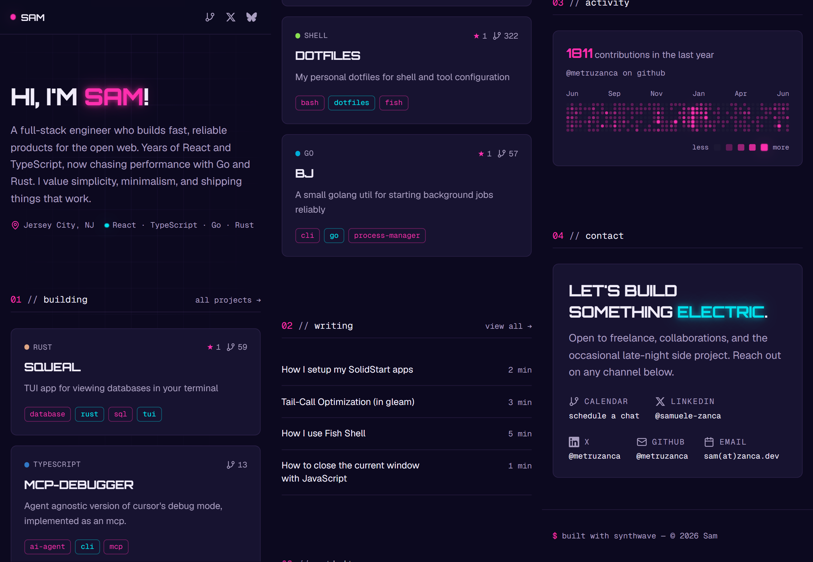

# metru.dev



Personal porfolio built with [Dioxus 0.7](https://dioxuslabs.com) and with a Synthwave inspired design-system with Geist + Orbitron fonts and dark-only color scheme.

## How it works

The site is a **Dioxus fullstack** app — Rust on both client and server. At build time:

- **Blog posts** are read from `blog/*.md`, code-generated into Rust constants via `build.rs`, and rendered with syntax-highlighted MDX.
- **GitHub data** (pinned repos, all public repos, contribution graph) is fetched from the GitHub GraphQL API using `octocrab` and baked into the binary.
- **Last.fm** data is fetched at request time via server functions using the Last.fm API. The `/music` page shows your currently playing track, recent scrobbles, total and daily play counts, and a waveform visualizer. The landing page includes a now-playing card with album art color extraction done server-side using the `image` crate.

At runtime the server renders pages via Dioxus SSR and hydrates them on the client.

## Hosting

Built into a single static binary via `dx bundle --web --release` and deployed as a Docker container on [Railway](https://railway.app). The `Dockerfile` uses `cargo-chef` for cached dependency builds and bundles the server + assets into a slim runtime image.

## Development

Set these environment variables in `.envrc` or `.env` before running:

```bash
export GITHUB_TOKEN="gh_your_token"     # or if authenticated via gh, this isn't needed
export LASTFM_API_KEY="your_api_key"    # from https://www.last.fm/api/account/create
export LASTFM_USERNAME="your_username"  # your Last.fm username
```

```bash
# Dioxus-CLI
dx serve
```

---

*This site was originally implemented in Rust with Dioxus; the original repo lives at [zanca.dev-dioxus](https://github.com/metruzanca/zanca.dev-dioxus).*
